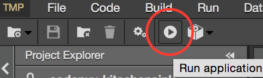
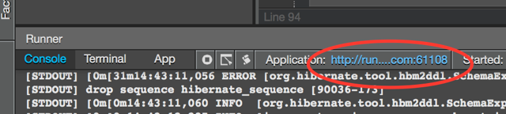
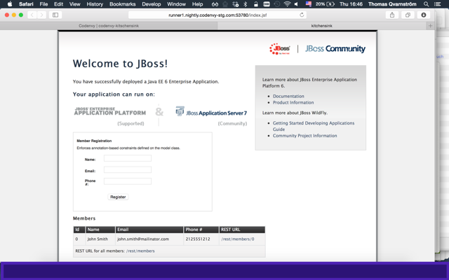

# TicketMonster - a JBoss example

TicketMonster is an online ticketing demo application that gets you started with JBoss technologies, and helps you learn and evaluate them. 

## Running the TicketMonster Appication in Codenvy Cloud IDE
1. To run the TicketMonster application from within Codenvy Worspace click the Run icon or from the meny click **Run**.

    

2. When the console has reported that JBoss WildFly has succesfully started, click on the link above the console output and a new browser window should appear with TicketMonster deployed.

    
    
3. Now a new browser window should open with the ticket monster demo application deployed.

	
	
4. If you'd like to you can now change things in the ticket monster application and redeploy by stoping and starting directly in the Codenvy IDE.

Here are a few instructions for building and running it. You can learn more about the example from the [tutorial](http://www.jboss.org/ticket-monster).

